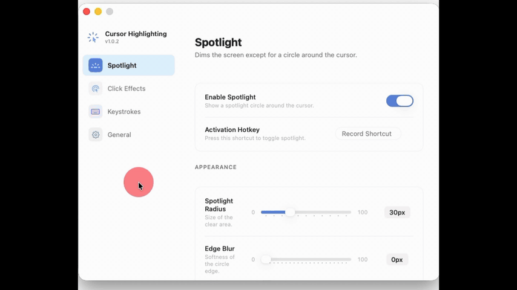

<table>
  <thead>
    <tr>
      <th style="text-align:center"><a href="README_ja.md">日本語</a></th>
      <th style="text-align:center"><a href="README.md">English</a></th>
    </tr>
  </thead>
</table>

<div align="center">

# Cursor Highlighting

**A macOS menu bar utility that visually highlights mouse operations and keyboard input.**

[](LICENSE)
[]()
[]()


</div>

---

## Table of Contents

- [Overview](#overview)
- [Features](#features)
- [Screenshots](#screenshots)
- [Requirements](#requirements)
- [Build \& Run](#build--run)
- [Permissions](#permissions)
- [Configuration](#configuration)
- [Keyboard Shortcuts](#keyboard-shortcuts)
- [Architecture](#architecture)
- [Tech Stack](#tech-stack)
- [Credits](#credits)
- [License](#license)

---

## Overview

Cursor Highlighting is a lightweight, menu-bar-only macOS utility designed for presentations, screen recordings, and live streaming. It provides three core visual feedback features — a mouse spotlight, click ring animations, and an on-screen keystroke HUD — all controllable via customizable global hotkeys.

The app runs entirely from the menu bar with no Dock icon, staying out of your way while providing clear visual cues for your audience.

---

## Features

- **Mouse Spotlight** — Dims the entire screen except for a configurable circle that follows your cursor, drawing attention to where you're pointing.

- **Click Effects** — Displays animated, color-coded expanding rings on left and right mouse clicks, making every click visible to viewers.

- **Keystroke Display** — Shows pressed keys in a bottom-center HUD overlay with native macOS modifier symbols (`⌘` `⌥` `⇧` `⌃` `⇪` `fn`), perfect for demonstrating keyboard shortcuts.

- **Global Hotkeys** — All features are togglable via fully customizable global keyboard shortcuts that work even when other apps are in the foreground.

- **Real-time Settings** — Every setting (colors, sizes, opacity, blur) applies instantly while features are active — no restart required.

- **Reset to Defaults** — One-click reset in Settings restores all configurations to their original values.

- **Launch at Login** — Optionally start the app automatically when you log in.

---

## Screenshots

<div align="center">
  
</div>


---

## Requirements

| Requirement | Version |
|---|---|
| **macOS** | 26.0 (Tahoe) or later |
| **Xcode** | 26.4+ (provides Swift 6.3 toolchain and macOS 26 SDK) |

> [!IMPORTANT]
> This app is **not sandboxed**. It requires Accessibility permission to monitor mouse and keyboard events via `CGEventTap`.

---

## Build & Run

Clone the repository and use the provided Makefile:

```bash
git clone https://github.com/Shuichi346/cursor-highlighting.git
cd cursor-highlighting
```

### Available Make Targets

| Command | Description |
|---|---|
| `make run` | Build and run the app directly |
| `make app` | Create a `.app` bundle at `build/CursorHighlighting.app` |
| `make build-release` | Build a release binary without bundling |
| `make clean` | Remove all build artifacts |

### Quick Start

```bash
# Run directly from source
make run

# Or build the .app bundle and open it
make app
open build/CursorHighlighting.app
```

---

## Permissions

This app requires **Accessibility** permission to monitor global mouse and keyboard events.

On first launch, you will be prompted to grant access. If the prompt doesn't appear or you need to grant it manually:

1. Open **System Settings**
2. Navigate to **Privacy & Security → Accessibility**
3. Enable **Cursor Highlighting**

The app polls for permission status and will activate features automatically once access is granted.

---

## Architecture

Built with **Swift 6.3 language mode** (strict concurrency). The app achieves zero data races by construction through a carefully designed architecture:

```
Sources/CursorHighlighting/
├── App/                        # Entry point, app state, permission management
│   ├── CursorHighlightingApp.swift
│   ├── AppState.swift
│   └── PermissionManager.swift
├── Bridge/                     # C callback → AsyncStream bridges
│   ├── CGEventBridge.swift     # CGEventTap → AsyncStream<BridgedKeyEvent>
│   └── NSEventBridge.swift     # NSEvent monitors → AsyncStream<BridgedMouseEvent>
├── Features/
│   ├── Spotlight/              # Fullscreen dim overlay with cursor-following circle
│   ├── ClickVisualizer/        # Expanding ring animations on mouse clicks
│   └── KeyStroke/              # Bottom-center HUD for pressed keys
├── Settings/                   # SwiftUI settings window with sidebar navigation
├── Overlay/                    # Shared NSPanel subclass for transparent overlays
├── Utilities/                  # Color serialization, key symbol mapping, localization
└── Resources/                  # Info.plist, Localizable.strings
```

### Concurrency Model

The central technical challenge is safely bridging `CGEventTapCallBack` (a C-convention function pointer called on an arbitrary thread) into Swift's structured concurrency. The solution uses `AsyncStream.Continuation` — which is thread-safe for `yield` calls — to pass events from the C callback into a `for await` loop running on `@MainActor`. The compiler statically verifies that all UI updates happen on the main actor, eliminating an entire class of threading bugs.

- **No `DispatchQueue.main.async`** anywhere in the codebase — all main-thread dispatch uses `@MainActor` isolation
- **Only one `@unchecked Sendable`** in the entire project (the minimal C-bridge wrapper in `CGEventBridge.swift`)
- All features use `AsyncStream` for event processing and `Defaults.updates()` for reactive settings observation

---

## Tech Stack

| Category | Technology |
|---|---|
| **Language** | Swift 6.3 (Swift 6 language mode) |
| **UI Framework** | SwiftUI + AppKit interop |
| **Graphics** | Core Graphics, Core Animation |
| **Concurrency** | Swift Structured Concurrency, AsyncStream |
| **Build System** | Swift Package Manager + Makefile |
| **Platform** | macOS 26.0 (Tahoe) |

### Dependencies

| Package | Purpose |
|---|---|
| [KeyboardShortcuts](https://github.com/sindresorhus/KeyboardShortcuts) | Global hotkey recording and listening |
| [LaunchAtLogin-Modern](https://github.com/sindresorhus/LaunchAtLogin-Modern) | Launch at Login integration |
| [Defaults](https://github.com/sindresorhus/Defaults) | Type-safe UserDefaults with reactive observation |

---

## Credits

This project relies on the excellent open-source libraries by [Sindre Sorhus](https://github.com/sindresorhus):

- [KeyboardShortcuts](https://github.com/sindresorhus/KeyboardShortcuts)
- [LaunchAtLogin-Modern](https://github.com/sindresorhus/LaunchAtLogin-Modern)
- [Defaults](https://github.com/sindresorhus/Defaults)

---

## License

This project is licensed under the **MIT License**. See the [LICENSE](LICENSE) file for details.

External models and libraries used by this tool have their own respective licenses.
